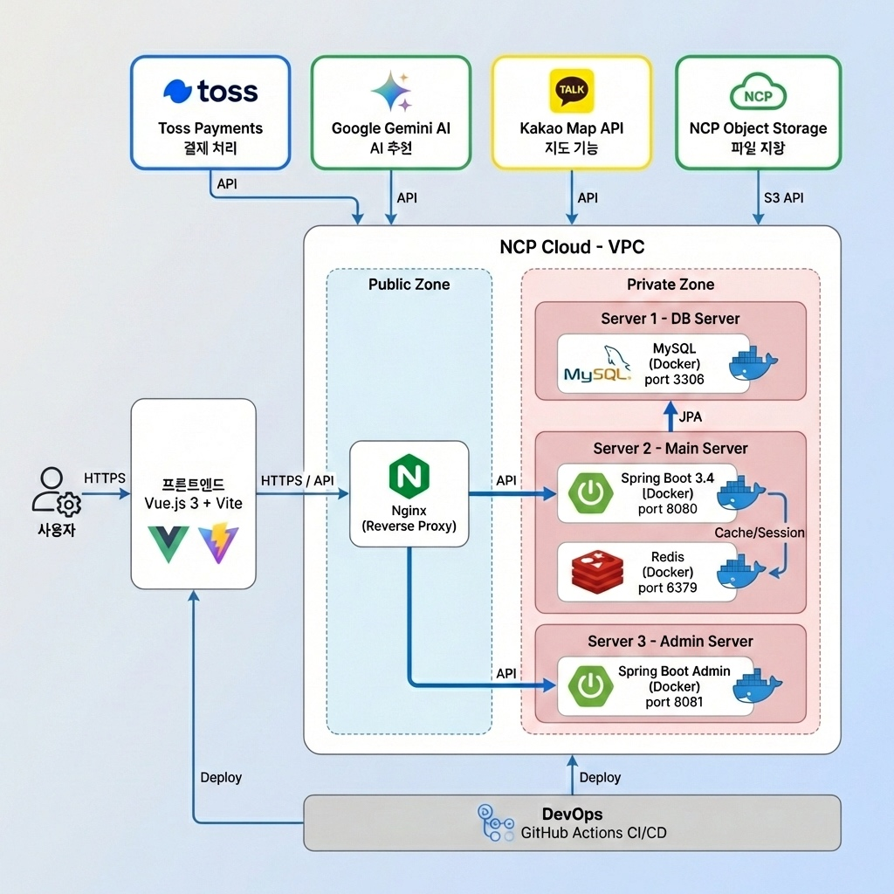

# 🏠 지금이곳 - AI 기반 B2B 호스트 관리 플랫폼

<div align="center">

**핵심 가치:** #AI_Insight #Zero_Trust_Infra #Service_Stability #Multi_Tier_Architecture

</div>

---

## 📑 목차

* [프로젝트 소개](https://www.google.com/search?q=%23-%ED%94%84%EB%A1%9C%EC%A0%9D%ED%8A%B8-%EC%86%8C%EA%B0%9C)
* [기술 스택](https://www.google.com/search?q=%23-%EA%B8%B0%EC%88%A0-%EC%8A%A4%ED%83%9D)
* [핵심 기여 및 기술적 성과](https://www.google.com/search?q=%23-%ED%95%B5%EC%8B%AC-%EA%B8%B0%EC%97%AC-%EB%B0%8F-%EA%B8%B0%EC%88%A0%EC%A0%81-%EC%84%B1%EA%B3%BC)
* [시스템 아키텍처](https://www.google.com/search?q=%23-%EC%8B%9C%EC%8A%A4%ED%85%9C-%EC%95%84%ED%82%A4%ED%85%8D%EC%B2%98)
* [트러블 슈팅 (Deep Dive)](https://www.google.com/search?q=%23-%ED%8A%B8%EB%9F%AC%EB%B8%94-%EC%8A%88%ED%8C%85-deep-dive)
* [회고](https://www.google.com/search?q=%23-%ED%9A%8C%EA%B3%A0)

---

## 🎯 프로젝트 소개

**"데이터 기반의 숙소 운영, AI 호스트 솔루션으로 완성하다"**

**지금이곳**은 중소형 게스트하우스 호스트를 위한 **AI 기반 컨설팅 및 관리 플랫폼**입니다. 생성형 AI(Google Gemini)를 활용해 흩어진 리뷰 데이터를 분석하여 실무적인 운영 리포트를 제공합니다. 특히, 사용자 트래픽과 관리 기능을 분리한 **Multi-tier 아키텍처**를 구축하여 시스템의 보안성과 확장성을 동시에 확보했습니다.

### 💡 핵심 해결 과제

* **Cold Start 문제:** 리뷰가 부족한 신규 숙소에 대한 데이터 기반 운영 가이드 제공
* **보안 위협:** 관리자 기능 및 DB 자원의 외부 노출 최소화
* **AI 불확실성:** LLM 응답의 비결정성(Non-deterministic)으로 인한 시스템 런타임 에러 방지

---

## 🛠️ 기술 스택

### Backend & AI

* **Core:** Java 17, Spring Boot 3.4, JPA (Hibernate), QueryDSL
* **Security:** Spring Security (JWT 기반 인증/인가)
* **AI:** Google Gemini Flash API (Prompt Engineering)

### Infrastructure & DevOps

* **Cloud:** Naver Cloud Platform (VCP, Subnet, ACG)
* **Server:** Nginx (Reverse Proxy), Docker, Ubuntu 22.04 LTS
* **Storage:** MySQL 8.0, Redis (Session/Cache), Object Storage

---

## 👨‍💻 핵심 기여 및 기술적 성과

### 1. AI 서비스의 가용성 및 신뢰성 설계 (High Availability)

* **Provider 패턴 도입:** `GEMINI`, `RULE`, `MOCK` 3가지 모드를 설정에 따라 전환하는 아키텍처를 설계하여 API 장애 시에도 서비스가 중단되지 않는 **Fallback 메커니즘**을 구축했습니다.
* **Cold Start 대응 로직:** 리뷰가 없는 숙소의 경우 지역/유형별 통계 데이터를 기반으로 한 `RULE` 기반 리포트를 생성하여 정보 제공률 100%를 달성했습니다.

### 2. Zero-Trust 기반의 보안 인프라 구축

* **Network Isolation:** NCP VPC 내에 Public/Private Subnet을 엄격히 분리했습니다.
* **폐쇄망 아키텍처:** Admin API 서버와 DB를 **Private Subnet**에 배치하고, 외부 접근을 원천 차단했습니다. 오직 Public Subnet의 Nginx 리버스 프록시와 Bastion Host를 통해서만 인가된 트래픽이 흐르도록 설계했습니다.

---

## 🏗️ 시스템 아키텍처

**보안과 성능의 균형을 위해 외부 접점(Nginx)과 내부 자원(Admin/DB)을 물리적으로 격리했습니다.**

<div align="center">

</div>

---

## 🚒 트러블 슈팅 (Deep Dive)

> **단순한 기능 구현을 넘어, 엔지니어링 관점에서 문제를 분석하고 해결한 기록입니다.**

<details>
<summary>👉 <b>1. LLM의 비결정적 응답 제어 및 방어적 파싱 (파싱 에러 0% 달성)</b></summary>

**[Situation]**
Gemini API가 요청한 JSON 규격과 다른 타입(String vs List)이나 불규칙한 Key 값을 반환하여 런타임에서 `ClassCastException`이 빈번하게 발생했습니다.

**[Action]**

* **Strict Prompting:** 응답 형식을 엄격히 규정하는 퓨샷(Few-shot) 프롬프트 엔지니어링을 적용하여 일관성을 높였습니다.
* **Defensive Parsing Layer:** 응답을 `Object`로 수용 후 `instanceof` 및 재귀적 타입 검사를 수행하는 전용 헬퍼 클래스(`convertToList`)를 구현했습니다.

```java
/* 예측 불가능한 AI 응답 타입을 안전하게 List<String>으로 정제 */
private List<String> convertToList(Object obj) {
    if (obj instanceof List<?>) {
        return ((List<?>) obj).stream().map(Object::toString).collect(Collectors.toList());
    }
    if (obj instanceof String) {
        return Arrays.asList(((String) obj).split(",")); // 쉼표 구분자 대응
    }
    return Collections.emptyList();
}

```

**[Result]**
비결정적인 AI 응답 환경에서도 **파싱 단계의 예외를 100% 핸들링**하여 리포트 생성 기능의 신뢰도를 확보했습니다.

</details>

<details>
<summary>👉 <b>2. Multi-tier 환경의 보안 라우팅 및 클라이언트 IP 추적</b></summary>

**[Problem]**
관리자 서버를 Private Subnet으로 격리한 후, Nginx 리버스 프록시를 통해 내부 IP로 통신이 전달되면서 백엔드 서버가 실제 사용자의 IP를 식별하지 못해 보안 감사 로그가 무력화되는 문제가 발생했습니다.

**[Solution]**

* **Nginx Header Forwarding:** Nginx 설정에서 `X-Real-IP` 및 `X-Forwarded-For` 헤더를 명시적으로 전달하도록 구성했습니다.
* **VPC 내부 라우팅 최적화:** `proxy_pass` 대상을 Private IP로 확정하여 보안 네트워크 내에서의 라우팅 경로를 최적화했습니다.

```nginx
location /api/admin/ {
    proxy_pass http://10.0.x.x:8081; # 격리된 Admin 서버로 라우팅
    proxy_set_header X-Real-IP $remote_addr;
    proxy_set_header X-Forwarded-For $proxy_add_x_forwarded_for;
}

```

**[Result]**
내부 자원의 물리적 보안을 유지하면서도, **정교한 보안 로깅 및 트래픽 분석 환경**을 구축했습니다.

</details>

<details>
<summary>👉 <b>3. Spring Profile을 활용한 논리적 환경 분리 및 인프라 최적화</b></summary>

**[Problem]**
단일 코드베이스에서 사용자(User)와 관리자(Admin)의 비즈니스 로직과 인프라 접근 권한(Private vs Public IP) 설정이 혼재되어 운영 효율이 저하되었습니다.

**[Action]**

* **Profile Isolation:** `default`(User)와 `admin` 프로필을 분리하고, 각 환경에 필요한 DB 커넥션 및 캐시 전략을 별도로 구성했습니다.
* **Conditional Resource Loading:** Admin 프로필 가동 시에만 내부망 전용 Redis와 DB 인스턴스에 접근하도록 설정하여 환경 간 간섭을 최소화했습니다.

**[Result]**
배포 환경에 최적화된 Jar 구동 환경을 구축하여 운영 복잡도를 낮추고 유지보수성을 향상시켰습니다.

</details>

---

## 🤔 회고

### 잘한 점 (Keep)

* **안정성 최우선 설계:** AI 응답 장애 및 인프라 보안 사고에 대비한 다중 방어 체계를 구축한 경험이 큰 자산이 되었습니다.
* **기술적 호기심:** 단순 서버 구축에 그치지 않고 VPC 환경에서의 네트워크 흐름을 직접 설계하며 인프라 역량을 내재화했습니다.

### 아쉬운 점 & 개선 방안 (Try)

* **CI/CD 자동화:** 짧은 기간 내에 배포 안정성을 확보하기 위해 수동 배포를 진행했으나, 향후 GitHub Actions를 활용한 무중단 배포(Blue-Green) 환경을 도입하고 싶습니다.
* **분산 추적 시스템:** MSA 구조로 나아가는 과정에서 서버 간 요청 추적을 위해 Sleuth나 Zipkin 같은 분산 추적 도구의 필요성을 느꼈습니다.

---

## 📬 Contact

* **Email:** koo4934@gmail.com
* **Portfolio:** [geeunii.github.io](https://geeunii.github.io)

---
